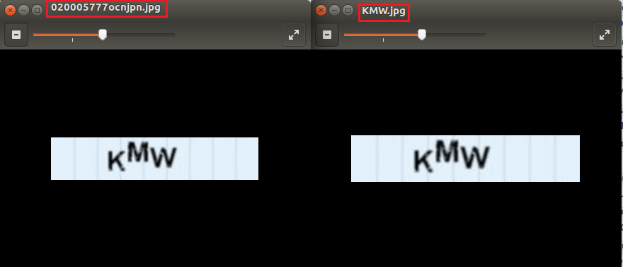

# Python-Captcha
Solving CAPTCHAs using OpenCV in Python 2.7 (port of old PureBasic code into better, neater python)

Requires OpenCV

Running the program will solve all the captchas in the captcha directory and rename the files:

